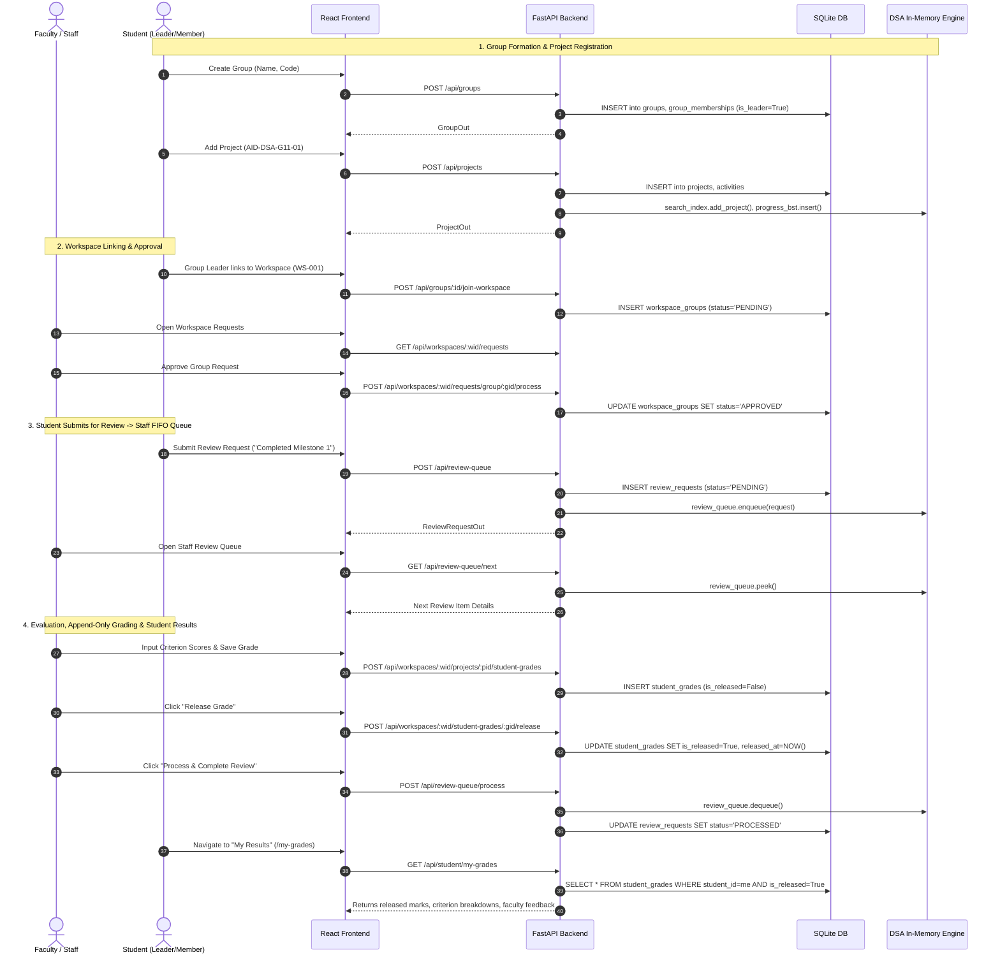

# MeshVault — Complete Frontend & Backend Functional Specification

> **Notice for UI Rebuild**: This document contains **purely functional specifications, data contracts, client-side state models, component interfaces, user interaction flows, role-based conditional logic, and complete API specifications**. All visual styling, layout spacing, color palettes, and typography details have been intentionally omitted to serve as a pure functional blueprint for UI implementation.

---

## Table of Contents
1. [Architecture & Client-Side Foundation](#1-architecture--client-side-foundation)
2. [Client-Side State & Context Management](#2-client-side-state--context-management)
3. [Routing, Page Contracts & Navigation](#3-routing-page-contracts--navigation)
4. [Component Functional Interfaces](#4-component-functional-interfaces)
5. [User Interaction Flows & State Transitions](#5-user-interaction-flows--state-transitions)
6. [Conditional Rendering & Role Access Matrix](#6-conditional-rendering--role-access-matrix)
7. [Frontend Service Layer & API Contract Specifications](#7-frontend-service-layer--api-contract-specifications)
8. [Backend Data Models & Entity Relationships](#8-backend-data-models--entity-relationships)
9. [Complete Backend API Specification (64 Endpoints)](#9-complete-backend-api-specification-64-endpoints)
10. [Data Structures & Algorithms (DSA) Engine](#10-data-structures--algorithms-dsa-engine)
11. [Module-by-Module Specification](#11-module-by-module-specification)
12. [Implementation & Feature Status Log](#12-implementation--feature-status-log)

---

## 1. Architecture & Client-Side Foundation

### 1.1 Technology Stack
* **Framework**: React 18+ (SPA with React Router DOM v6)
* **Build Tooling**: Vite
* **HTTP Client**: Native Fetch API wrapped in centralized API utility (`api.js`)
* **State Management**: React Context API (`AuthContext`) + Local Component State (`useState`, `useEffect`)
* **Persistence**: Browser `localStorage` for session tokens

### 1.2 Authentication & Session Tracking
* **Session Storage Key**: `meshvault_session` in `localStorage`.
* **Session Payload Shape**:
  ```json
  {
    "id": 1,
    "name": "Prof. Alan Turing",
    "email": "turing@university.edu",
    "user_id": "FAC-001",
    "role": "STAFF",
    "created_at": "2026-09-07T10:00:00Z",
    "token": "64_character_hexadecimal_string"
  }
  ```
* **Token Injection**: The `api.js` request handler automatically reads `meshvault_session` from `localStorage`. If a `token` exists, it sets HTTP Header `Authorization: Bearer <token>`.
* **Error Interception**: If any API response returns non-2xx status code:
  * Extracts error message from response JSON `body.detail` (supporting string, array of validation errors, or objects) or `body.message`.
  * Throws a standard JavaScript `Error(message)`.
* **Route Guards (`PrivateRoute`)**:
  * Wraps all internal routes.
  * Evaluates `isAuthenticated` from `AuthContext`.
  * If `false`, redirects to `/login` with `replace: true`.
* **Role-Gated Routes**:
  * `/my-grades`: Accessible only if `user.role === 'STUDENT'`. Otherwise redirects to `/dashboard`.
  * `/review-queue`: Accessible only if `user.role === 'STAFF'`. Otherwise redirects to `/dashboard`.

---

## 2. Client-Side State & Context Management

### 2.1 `AuthContext` (`src/context/AuthContext.jsx`)

| State Property | Type | Initial Value | Updated When | Description |
| :--- | :--- | :--- | :--- | :--- |
| `user` | `Object \| null` | `null` | App mount (`useEffect`) or `login()` / `logout()` | Current logged-in user profile with token |
| `loading` | `boolean` | `true` | App mount after reading `localStorage` | Blocks route rendering until storage checked |
| `isAuthenticated`| `boolean` | Derived (`!!user`) | Whenever `user` changes | Boolean authentication flag |

#### Methods Exposed by `useAuth()`:
* **`login(email, password)`**:
  * Calls `authService.login(email, password)`.
  * On success: sets `user` state to `{ ...res.user, token: res.token }`.
  * Returns API response `{ success: bool, user, token, message }`.
* **`logout()`**:
  * Calls `authService.logout()` (removes `localStorage.meshvault_session`).
  * Sets `user` state to `null`.

---

## 3. Routing, Page Contracts & Navigation

All application routes registered in `App.jsx`:

| Route Path | Page Component | Role Restriction | Purpose & Data Displayed |
| :--- | :--- | :--- | :--- |
| `/login` | `Login.jsx` | Public (Unauthenticated) | Email/Password credentials entry form |
| `/dashboard` | `Dashboard.jsx` | Authenticated (All) | Top-level summary metric cards, upcoming deadlines, recent chronological activities, team member rosters |
| `/workspace` | `Workspace.jsx` | Authenticated (All) | Course workspace hub, access whitelisting, rubric grading scheme editor, approved group/project rosters, workspace Mark Registry (Gradebook) |
| `/workspace/new` | `CreateWorkspace.jsx` | Staff Only | Form to create a new academic course workspace with custom ID |
| `/groups` | `Groups.jsx` | Authenticated (All) | Roster of groups, Create Group modal, Join Group via code modal, Join Workspace modal |
| `/groups/:id` | `GroupDetail.jsx` | Authenticated (All) | Group profile, member list, leader promotions, member kicks, project creation, join/leave workspace requests, FIFO review submissions, group activity history |
| `/projects` | `Projects.jsx` | Authenticated (All) | Repository grid of all projects scoped to user |
| `/projects/new` | `CreateProject.jsx` | Authenticated (All) | Form to create a project, assign unique string ID, associate group & workspace |
| `/projects/:projectId` | `ProjectDetail.jsx` | Authenticated (All) | Project parameters, milestone tracking, threaded workspace comments, student individual grading panel, review submission |
| `/projects/:projectId/edit` | `EditProject.jsx` | Authenticated (All) | Edit project title, description, course, priority, status, progress %, deadline; delete project |
| `/my-grades` | `MyGrades.jsx` | Student Only | Student personal results portal: aggregate metrics, average %, letter grade, breakdown by workspace & project with criteria scores and feedback |
| `/search` | `SmartSearch.jsx` | Authenticated (All) | Instant hash-table project search by exact ID, exact name, or partial substring |
| `/progress-analytics` | `ProgressAnalytics.jsx` | Authenticated (All) | Range-based project query explorer powered by BST inorder & range searches |
| `/review-queue` | `ReviewQueue.jsx` | Staff Only | FIFO review queue for instructors: peek head item, evaluate students, dequeue/process request |
| `/audit-trail` | `AuditTrail.jsx` | Authenticated (All) | Chronological system mutation log tracking all project changes |
| `/priority-engine` | `Building.jsx` | Authenticated (All) | Placeholder for Min-Heap automated priority scheduler |
| `/sprint-optimizer` | `Building.jsx` | Authenticated (All) | Placeholder for 0/1 Knapsack milestone optimizer |
| `/algorithm-lab` | `Building.jsx` | Authenticated (All) | Placeholder for DAG topological sort milestone graph |
| `/github` | `Building.jsx` | Student Only | Placeholder for GitHub commit/PR synchronization engine |
| `/profile` | `Profile.jsx` | Authenticated (All) | User metadata, university ID, database PK, logout trigger |
| `*` / `/` | Navigate | Any | Fallback redirect to `/login` |

---

## 4. Component Functional Interfaces

### 4.1 `AppLayout` (`src/layouts/AppLayout.jsx`)
* **Props In**:
  * `title` (`string`, required): Page title passed to the `Navbar`.
  * `children` (`ReactNode`, required): Main page content.
* **Data Out / Actions**: None.
* **Functional Behavior**: Renders the persistent `Sidebar` on the left, `Navbar` on top, and content container.

### 4.2 `Sidebar` (`src/components/Sidebar.jsx`)
* **Props In**: None.
* **State**: `pendingReviewCount` (`number`).
* **Interactions & Behavior**:
  * On mount: If `user.role === 'STAFF'`, calls `projectService.getReviewQueueCount()` immediately and schedules recurring poll every 6,000ms.
  * Nav items conditionally displayed based on `user.role`:
    * `STUDENT`: Adds "🎓 My Results" (`/my-grades`) and "🐙 GitHub Sync" (`/github`).
    * `STAFF`: Adds "📋 Review Queue" (`/review-queue`) with live notification badge showing `pendingReviewCount`.
  * Logout button calls `logout()` from `AuthContext`.

### 4.3 `Navbar` (`src/components/Navbar.jsx`)
* **Props In**:
  * `title` (`string`, required): Title string.
* **Interactions & Behavior**: Reads current `user` from `useAuth()`. Renders user full name, role badge, user ID string, and computed 2-letter uppercase initials avatar.

### 4.4 `StudentGradingPanel` (`src/components/StudentGradingPanel.jsx`)
* **Props In**:
  * `workspaceId` (`number`, required): Workspace internal ID.
  * `projectId` (`string`, required): Project manual ID (e.g. `AID-DSA-G11-01`).
  * `groupName` (`string`, optional): Display name of group.
  * `members` (`Array<{id: number, name: string, user_id: string}>`, required): List of student group members.
* **State**:
  * `gradingScheme` (`Object | null`): Workspace criteria rubric.
  * `studentGrades` (`Array<Object>`): Full grade records for this project.
  * `formState` (`Object`): Map `{ [studentId]: { criterionScores: { [critId]: number }, totalScore: string, notes: string } }`.
  * `savingStudentId` (`number | null`): ID of student currently being saved.
  * `releasingGradeId` (`number | null`): ID of grade currently being released.
  * `expandedHistory` (`Object`): Map `{ [studentId]: boolean }` for accordion toggles.
* **Interactions & Computations**:
  * **Auto Total Calculation**: When criterion score inputs change, automatically sums all criterion values into `totalScore`.
  * **Direct Total Score Input**: Allows manual entry of total score when no rubric criteria exist.
  * **Save Grade**: Submits `POST /api/workspaces/:wid/projects/:pid/student-grades` with `{ student_id, total_score, max_score, notes, criterion_scores }`. Appends immutable record with `is_released = False`.
  * **Release Grade**: Calls `POST /api/workspaces/:wid/projects/:pid/student-grades/:gid/release`. Updates `is_released = True`.
  * **Evaluation History Accordion**: Toggles historical evaluation log per student showing previous attempts and dates.

### 4.5 `ProjectCard` (`src/components/ProjectCard.jsx`)
* **Props In**:
  * `project` (`Object`, required): `{ project_id, name, description, group_id, group_name, course, priority, status, progress, deadline }`.
* **Interactions & Behavior**: Links to `/projects/:projectId` and `/groups/:groupId`. Displays computed status badges, priority badges, progress percentage meters, and formatted deadline dates.

### 4.6 `GroupCard` (`src/components/GroupCard.jsx`)
* **Props In**:
  * `group` (`Object`, required): `{ id, group_number, name, description, member_count, project_count, workspace_id }`.
* **Interactions & Behavior**: Links to `/groups/:id`. Displays member count badge, workspace assignment badge, and project counter.

### 4.7 `StatCard` (`src/components/StatCard.jsx`)
* **Props In**:
  * `label` (`string`, required): Metric title.
  * `value` (`number | string`, required): Metric value.
  * `icon` (`string`, required): Emoji icon identifier.
  * `color` (`string`, optional): Semantic status key (`'success'`, `'warning'`, `'error'`, `'info'`, `'default'`).

### 4.8 `EmptyState` (`src/components/EmptyState.jsx`)
* **Props In**:
  * `icon` (`string`, optional): Display icon.
  * `title` (`string`, optional): Empty state heading.
  * `text` (`string`, optional): Descriptive guidance message.

### 4.9 `LoadingSpinner` (`src/components/LoadingSpinner.jsx`)
* **Props In**:
  * `message` (`string`, optional): Status text displayed alongside the spinner.

---

## 5. User Interaction Flows & State Transitions



---

## 6. Conditional Rendering & Role Access Matrix

### 6.1 View-Level Role Rendering Rules

```
Dashboard:
  ├── Staff: Displays Total Registered Students counter
  └── Student: Displays Group Members list widget

Workspace (/workspace):
  ├── Staff Host:
  │    ├── "+ New Workspace" button
  │    ├── "Access Control" modal button
  │    ├── "Edit Grading Scheme" modal button
  │    ├── "Delete Workspace" button
  │    ├── "Mark Registry (Gradebook)" tab showing all student grades across workspace
  │    └── "Direct Release" buttons on unreleased grade rows
  └── Student:
       └── "Join Workspace" modal button

Group Detail (/groups/:id):
  ├── Leader Only:
  │    ├── "Promote to Leader" buttons on member rows
  │    ├── "Remove Member" buttons on other members
  │    ├── "Delete Group" button
  │    ├── "Join Workspace" action
  │    └── "Request Leave Workspace" action
  └── Non-Leader Member:
       └── "Leave Group" button on self row

Project Detail (/projects/:projectId):
  ├── Staff:
  │    ├── Top-level Review Comment posting form
  │    ├── Threaded comment reply forms
  │    ├── Legacy Faculty Evaluation form
  │    └── Student Individual Grading Panel (evaluation inputs + release buttons)
  └── Student (Team Member):
       ├── Submit Review Request to FIFO Queue form
       ├── Threaded comment reply forms (replies to faculty comments)
       └── Student Own Released Grades display (read-only)

Sidebar:
  ├── Staff: "Review Queue" with live pending count badge
  └── Student: "My Results" (/my-grades) and "GitHub Sync" (/github)
```

---

## 7. Frontend Service Layer & API Contract Specifications

All frontend services reside in `src/services/` and interface with the backend via `api.js`.

### 7.1 `authService` (`src/services/authService.js`)
* **`login(email, password)`**: `POST /api/auth/login` → Payload: `{ email, password }` → Returns `{ success, token, user }`.
* **`getStudents()`**: `GET /api/students` → Returns `Array<UserOut>`.
* **`logout()`**: Clears `localStorage`.
* **`getCurrentUser()`**: Reads parsed object from `localStorage`.
* **`isAuthenticated()`**: Returns `boolean`.
* **`getRole()`**: Returns `'STAFF'` | `'STUDENT'` | `null`.

### 7.2 `workspaceService` (`src/services/workspaceService.js`)
* **`getWorkspaces(userId, role)`**: `GET /api/workspaces` → Returns `Array<WorkspaceOut>`.
* **`getWorkspace(id, userId, role)`**: `GET /api/workspaces/:id` → Returns `WorkspaceDetail`.
* **`createWorkspace(userId, data)`**: `POST /api/workspaces` → Payload: `{ workspace_id, name, course_code, course_name, academic_year, description }` → Returns `WorkspaceOut`.
* **`deleteWorkspace(id)`**: `DELETE /api/workspaces/:id` → Returns `{ success, message }`.
* **`joinWorkspace(workspaceCode)`**: `POST /api/workspaces/join` → Payload: `{ workspace_code }` → Returns `{ success, message }`.
* **`getJoinRequests(workspaceId)`**: `GET /api/workspaces/:id/join-requests` → Returns `Array<JoinRequest>`.
* **`getWorkspaceAccess(id)`**: `GET /api/workspaces/:id/access` → Returns `{ is_restricted, allowed_user_ids, allowed_group_ids }`.
* **`updateWorkspaceAccess(id, data)`**: `POST /api/workspaces/:id/access` → Payload: `{ is_restricted, allowed_user_ids, allowed_group_ids }` → Returns `{ success, message }`.
* **`getGradingScheme(id)`**: `GET /api/workspaces/:id/grading-scheme` → Returns `GradingSchemeOut`.
* **`saveGradingScheme(id, data)`**: `POST /api/workspaces/:id/grading-scheme` → Payload: `{ criteria: [{ name, description, max_marks, weight }] }` → Returns `GradingSchemeOut`.
* **`getWorkspaceStudentGrades(id)`**: `GET /api/workspaces/:id/student-grades` → Returns `Array<StudentGradeOut>`.
* **`approveGroupRemoval(workspaceId, groupId)`**: `POST /api/workspaces/:wid/remove/group/:gid/approve` → Returns `{ success, message }`.
* **`rejectGroupRemoval(workspaceId, groupId)`**: `POST /api/workspaces/:wid/remove/group/:gid/reject` → Returns `{ success, message }`.

### 7.3 `groupService` (`src/services/groupService.js`)
* **`getGroups(workspaceId, userId, role)`**: `GET /api/groups?workspace_id=..&user_id=..&role=..` → Returns `Array<GroupOut>`.
* **`getGroup(id)`**: `GET /api/groups/:id` → Returns `GroupDetail`.
* **`createGroup(name, code, description, workspaceCode)`**: `POST /api/groups` → Payload: `{ name, code, description, workspace_code }` → Returns `GroupOut`.
* **`joinGroup(code)`**: `POST /api/groups/join` → Payload: `{ code }` → Returns `{ success, message, group }`.
* **`promoteToLeader(groupId, userId)`**: `POST /api/groups/:gid/promote` → Payload: `{ user_id }` → Returns `{ success, message }`.
* **`removeMember(groupId, userId)`**: `DELETE /api/groups/:gid/members/:uid` → Returns `{ success, message }`.
* **`deleteGroup(groupId)`**: `DELETE /api/groups/:gid` → Returns `{ success, message }`.
* **`joinWorkspace(groupId, workspaceCode)`**: `POST /api/groups/:gid/join-workspace` → Payload: `{ workspace_code }` → Returns `{ success, message }`.
* **`requestLeaveWorkspace(groupId, workspaceId)`**: `POST /api/workspaces/:wid/remove/group/:gid` → Returns `{ success, message }`.
* **`getGroupActivities(groupId)`**: `GET /api/groups/:gid/activities` → Returns `Array<ActivityOut>`.

### 7.4 `projectService` (`src/services/projectService.js`)
* **`getProjects(workspaceId, groupId, userId, role)`**: `GET /api/projects?...` → Returns `Array<ProjectOut>`.
* **`getProject(projectId)`**: `GET /api/projects/:projectId` → Returns `ProjectDetail`.
* **`getWorkspaceProject(workspaceId, projectId)`**: `GET /api/workspaces/:wid/projects/:pid` → Returns `ProjectDetail`.
* **`createProject(data)`**: `POST /api/projects` → Payload: `{ project_id, name, description, group_id, course, priority, status, progress, deadline, workspace_id }` → Returns `ProjectOut`.
* **`updateProject(projectId, data)`**: `PUT /api/projects/:projectId` → Payload: `{ name, description, priority, status, progress, deadline, course }` → Returns `ProjectOut`.
* **`deleteProject(projectId)`**: `DELETE /api/projects/:projectId` → Returns `{ success, message }`.
* **`addMilestone(projectId, data)`**: `POST /api/projects/:projectId/milestones` → Payload: `{ title, description, status, due_date }` → Returns `MilestoneOut`.
* **`getDashboard(userId, role)`**: `GET /api/dashboard?user_id=..&role=..` → Returns `DashboardStats`.
* **`getProgressRange(minProgress, maxProgress, userId, role)`**: `GET /api/progress/range?min_progress=..&max_progress=..` → Returns `Array<ProjectOut>`.
* **`getReviewQueue(workspaceId)`**: `GET /api/review-queue?workspace_id=..` → Returns `Array<ReviewRequestOut>`.
* **`getReviewQueueNext(workspaceId)`**: `GET /api/review-queue/next?workspace_id=..` → Returns `ReviewRequestOut | null`.
* **`getReviewQueueCount()`**: `GET /api/review-queue/count` → Returns `{ count: number }`.
* **`submitReviewRequest(data)`**: `POST /api/review-queue` → Payload: `{ project_id, submitted_by, request_type, message }` → Returns `ReviewRequestOut`.
* **`processReviewRequest(workspaceId)`**: `POST /api/review-queue/process` → Returns `{ success, processed_request }`.
* **`getWorkspaceComments(workspaceId, projectId)`**: `GET /api/workspaces/:wid/projects/:pid/comments` → Returns `Array<ReviewCommentOut>`.
* **`addWorkspaceComment(workspaceId, projectId, comment)`**: `POST /api/workspaces/:wid/projects/:pid/comments` → Payload: `{ comment }` → Returns `ReviewCommentOut`.
* **`replyToComment(workspaceId, projectId, commentId, comment)`**: `POST /api/workspaces/:wid/projects/:pid/comments/:cid/reply` → Payload: `{ comment }` → Returns `ReviewCommentOut`.
* **`submitEvaluation(workspaceId, projectId, data)`**: `POST /api/workspaces/:wid/projects/:pid/evaluations` → Payload: `{ score, max_score, notes, grading_scheme_id, criterion_scores }` → Returns `EvaluationOut`.
* **`getEvaluations(workspaceId, projectId)`**: `GET /api/workspaces/:wid/projects/:pid/evaluations` → Returns `Array<EvaluationOut>`.
* **`getStudentGrades(workspaceId, projectId)`**: `GET /api/workspaces/:wid/projects/:pid/student-grades` → Returns `Array<StudentGradeOut>`.
* **`submitStudentGrade(workspaceId, projectId, data)`**: `POST /api/workspaces/:wid/projects/:pid/student-grades` → Payload: `{ student_id, total_score, max_score, notes, criterion_scores }` → Returns `StudentGradeOut`.
* **`releaseStudentGrade(workspaceId, projectId, gradeId)`**: `POST /api/workspaces/:wid/projects/:pid/student-grades/:gid/release` → Returns `{ success, grade }`.
* **`releaseStudentGradeDirect(workspaceId, gradeId)`**: `POST /api/workspaces/:wid/student-grades/:gid/release` → Returns `{ success, grade }`.
* **`getMyGrade(workspaceId, projectId)`**: `GET /api/workspaces/:wid/projects/:pid/my-grade` → Returns `Array<StudentGradeOut>`.
* **`getAllMyGrades()`**: `GET /api/student/my-grades` → Returns `Array<StudentGradeOut>`.

### 7.5 `searchService` (`src/services/searchService.js`)
* **`searchProjects(query, userId, role)`**: `GET /api/search/projects?q=..&user_id=..&role=..` → Returns `{ query, total_results, results: Array<ProjectSearchResult> }`.

### 7.6 `activityService` (`src/services/activityService.js`)
* **`getActivities(userId, role)`**: `GET /api/activities?user_id=..&role=..` → Returns `Array<ActivityOut>`.

---

## 8. Backend Data Models & Entity Relationships

The SQLite database (`backend/meshvault.db`) contains 14 tables:

```
Table: users
  ├── id (PK, Integer, Auto)
  ├── name (String 100, Not Null)
  ├── email (String 150, Unique, Not Null, Index)
  ├── user_id (String 50, Unique, Not Null, Index)
  ├── password_hash (String 255, Not Null)
  ├── role (String 20, Not Null) [STAFF | STUDENT]
  └── created_at (DateTime, Default: UTC Now)

Table: workspaces
  ├── id (PK, Integer, Auto)
  ├── workspace_id (String 50, Unique, Nullable, Index) [e.g. WS-001]
  ├── name (String 200, Not Null)
  ├── course_code (String 50, Not Null)
  ├── course_name (String 200, Not Null)
  ├── academic_year (String 20, Not Null)
  ├── description (Text, Nullable)
  ├── created_by (FK -> users.id, Not Null)
  ├── is_restricted (Boolean, Not Null, Default: 0)
  ├── join_code (String 50, Unique, Nullable, Index)
  └── created_at (DateTime, Default: UTC Now)

Table: workspace_groups
  ├── id (PK, Integer, Auto)
  ├── workspace_id (FK -> workspaces.id ondelete CASCADE)
  ├── group_id (FK -> groups.id ondelete CASCADE)
  ├── requested_by (FK -> users.id, Not Null)
  ├── status (String 30, Default 'PENDING') [PENDING|APPROVED|REJECTED|REMOVAL_PENDING|REMOVED]
  ├── rejection_reason (Text, Nullable)
  ├── requested_at (DateTime, Default: UTC Now)
  ├── approved_at (DateTime, Nullable)
  └── rejected_at (DateTime, Nullable)
  └── UniqueConstraint(workspace_id, group_id)

Table: workspace_projects
  ├── id (PK, Integer, Auto)
  ├── workspace_id (FK -> workspaces.id ondelete CASCADE)
  ├── project_id (FK -> projects.id ondelete CASCADE)
  ├── requested_by (FK -> users.id, Not Null)
  ├── status (String 30, Default 'PENDING') [PENDING|APPROVED|REJECTED|REMOVAL_PENDING|REMOVED]
  ├── rejection_reason (Text, Nullable)
  ├── requested_at (DateTime, Default: UTC Now)
  ├── approved_at (DateTime, Nullable)
  └── rejected_at (DateTime, Nullable)
  └── UniqueConstraint(workspace_id, project_id)

Table: groups
  ├── id (PK, Integer, Auto)
  ├── workspace_id (FK -> workspaces.id ondelete CASCADE, Nullable)
  ├── group_number (String 50, Nullable) [e.g. G1, G11]
  ├── name (String 100, Not Null)
  ├── description (Text, Nullable)
  ├── code (String 50, Unique, Nullable, Index)
  ├── created_by (FK -> users.id, Nullable)
  └── created_at (DateTime, Default: UTC Now)
  └── UniqueConstraint(workspace_id, group_number)

Table: group_memberships
  ├── id (PK, Integer, Auto)
  ├── group_id (FK -> groups.id, Not Null)
  ├── user_id (FK -> users.id, Not Null)
  ├── is_leader (Boolean, Not Null, Default: 0)
  └── joined_at (DateTime, Default: UTC Now)
  └── UniqueConstraint(group_id, user_id)

Table: projects
  ├── id (PK, Integer, Auto)
  ├── project_id (String 50, Unique, Not Null, Index) [e.g. AID-DSA-G11-01]
  ├── name (String 200, Not Null)
  ├── description (Text, Nullable)
  ├── group_id (FK -> groups.id, Not Null)
  ├── course (String 100, Nullable)
  ├── status (String 30, Not Null, Default 'NOT_STARTED') [NOT_STARTED|IN_PROGRESS|COMPLETED]
  ├── priority (String 20, Not Null, Default 'MEDIUM') [LOW|MEDIUM|HIGH]
  ├── progress (Float, Default 0.0) [0.0 - 100.0]
  ├── deadline (Date, Nullable)
  ├── created_at (DateTime, Default: UTC Now)
  └── updated_at (DateTime, Default: UTC Now, onupdate UTC Now)

Table: milestones
  ├── id (PK, Integer, Auto)
  ├── project_id (FK -> projects.id, Not Null)
  ├── title (String 200, Not Null)
  ├── description (Text, Nullable)
  ├── status (String 20, Not Null, Default 'PENDING') [PENDING|IN_PROGRESS|COMPLETED]
  ├── due_date (Date, Nullable)
  └── created_at (DateTime, Default: UTC Now)

Table: activities
  ├── id (PK, Integer, Auto)
  ├── project_id (FK -> projects.id, Not Null)
  ├── user_id (FK -> users.id, Not Null)
  ├── activity_type (String 50, Not Null)
  ├── message (Text, Not Null)
  └── created_at (DateTime, Default: UTC Now)

Table: review_requests
  ├── id (PK, Integer, Auto)
  ├── project_id (FK -> projects.id, Not Null)
  ├── submitted_by (FK -> users.id, Not Null)
  ├── request_type (String 50, Not Null)
  ├── message (Text, Not Null)
  ├── status (String 20, Not Null, Default 'PENDING') [PENDING|PROCESSED]
  └── created_at (DateTime, Default: UTC Now)

Table: user_sessions
  ├── id (PK, Integer, Auto)
  ├── user_id (FK -> users.id ondelete CASCADE, Not Null)
  ├── token (String 255, Unique, Not Null, Index)
  └── created_at (DateTime, Default: UTC Now)

Table: workspace_access
  ├── id (PK, Integer, Auto)
  ├── workspace_id (FK -> workspaces.id ondelete CASCADE, Not Null)
  ├── user_id (FK -> users.id ondelete CASCADE, Nullable)
  ├── group_id (FK -> groups.id ondelete CASCADE, Nullable)
  ├── status (String 30, Not Null, Default 'APPROVED') [PENDING|APPROVED|REJECTED]
  ├── rejection_reason (Text, Nullable)
  ├── requested_at (DateTime, Default: UTC Now)
  └── processed_at (DateTime, Nullable)

Table: grading_schemes
  ├── id (PK, Integer, Auto)
  ├── workspace_id (FK -> workspaces.id ondelete CASCADE, Unique, Not Null)
  └── created_at (DateTime, Default: UTC Now)

Table: grading_criteria
  ├── id (PK, Integer, Auto)
  ├── scheme_id (FK -> grading_schemes.id ondelete CASCADE, Not Null)
  ├── name (String 100, Not Null)
  ├── description (Text, Nullable)
  ├── max_marks (Float, Not Null)
  ├── weight (Float, Nullable)
  └── sort_order (Integer, Default 0)

Table: review_comments
  ├── id (PK, Integer, Auto)
  ├── workspace_id (FK -> workspaces.id ondelete CASCADE, Nullable, Index)
  ├── project_id (FK -> projects.id ondelete CASCADE, Not Null)
  ├── user_id (FK -> users.id ondelete CASCADE, Not Null)
  ├── parent_comment_id (FK -> review_comments.id ondelete CASCADE, Nullable)
  ├── comment (Text, Not Null)
  └── created_at (DateTime, Default: UTC Now)

Table: project_evaluations
  ├── id (PK, Integer, Auto)
  ├── workspace_id (FK -> workspaces.id ondelete CASCADE, Not Null, Index)
  ├── project_id (FK -> projects.id ondelete CASCADE, Not Null, Index)
  ├── evaluator_id (FK -> users.id, Not Null)
  ├── grading_scheme_id (FK -> grading_schemes.id, Nullable)
  ├── score (Float, Not Null)
  ├── max_score (Float, Not Null, Default 100.0)
  ├── notes (Text, Nullable)
  ├── criterion_scores (Text, Nullable) [JSON array]
  └── created_at (DateTime, Default: UTC Now)

Table: student_grades
  ├── id (PK, Integer, Auto)
  ├── workspace_id (FK -> workspaces.id ondelete CASCADE, Not Null, Index)
  ├── project_id (FK -> projects.id ondelete CASCADE, Not Null, Index)
  ├── student_id (FK -> users.id, Not Null, Index)
  ├── evaluator_id (FK -> users.id, Not Null)
  ├── criterion_scores (Text, Nullable) [JSON array]
  ├── total_score (Float, Not Null)
  ├── max_score (Float, Not Null, Default 100.0)
  ├── notes (Text, Nullable)
  ├── is_released (Boolean, Not Null, Default 0)
  ├── released_at (DateTime, Nullable)
  └── created_at (DateTime, Default: UTC Now)
  * IMMUTABLE APPEND-ONLY (No updated_at)
```

---

## 9. Complete Backend API Specification (64 Endpoints)

All endpoints mounted under `/api` in `backend/routes.py`.

### 9.1 Authentication & User Registry
1. **`POST /api/auth/login`**: Public. Authenticates email/password against bcrypt hash; generates 64-char hex session token in `user_sessions`. Returns `{ success: true, token, user }`.
2. **`GET /api/students`**: Staff only. Returns list of all registered student accounts.

### 9.2 Workspaces & Access Control
3. **`GET /api/workspaces`**: Returns workspaces visible to caller (Staff: created by self; Student: unrestricted workspaces + approved whitelisted workspaces).
4. **`POST /api/workspaces`**: Staff only. Creates workspace with custom/auto-generated `workspace_id` code.
5. **`DELETE /api/workspaces/{workspace_id}`**: Staff host only. Cascades deletion of workspace links and records.
6. **`GET /api/workspaces/{workspace_id}`**: Returns scoped workspace metadata, associated groups, and approved projects.
7. **`POST /api/workspaces/join`**: Student only. Submits join request via `workspace_code`. Creates `WorkspaceAccess(status='PENDING')`.
8. **`GET /api/workspaces/{workspace_id}/join-requests`**: Staff host only. Lists pending student access requests.
9. **`POST /api/workspaces/{workspace_id}/join-requests/{request_id}/approve`**: Staff host only. Grants student access (`status='APPROVED'`).
10. **`POST /api/workspaces/{workspace_id}/join-requests/{request_id}/reject`**: Staff host only. Rejects access with optional reason.
11. **`GET /api/workspaces/{workspace_id}/access`**: Staff host only. Returns `{ is_restricted, allowed_user_ids, allowed_group_ids }`.
12. **`POST /api/workspaces/{workspace_id}/access`**: Staff host only. Updates `is_restricted` flag and syncs allowed user/group whitelist records.
13. **`GET /api/workspaces/{workspace_id}/requests`**: Staff host only. Lists pending group/project link requests.
14. **`POST /api/workspaces/{workspace_id}/requests/group/{group_id}/process`**: Staff host only. Batch/individual approval or rejection of group + project join requests.
15. **`POST /api/workspaces/{workspace_id}/remove/group/{group_id}`**: Group Leader only. Submits group removal request (`status='REMOVAL_PENDING'`).
16. **`POST /api/workspaces/{workspace_id}/remove/project/{project_id}`**: Group Leader only. Submits project removal request (`status='REMOVAL_PENDING'`).
17. **`POST /api/workspaces/{workspace_id}/remove/group/{group_id}/approve`**: Staff host only. Approves removal (`status='REMOVED'`).
18. **`POST /api/workspaces/{workspace_id}/remove/group/{group_id}/reject`**: Staff host only. Rejects removal (`status='APPROVED'`).
19. **`POST /api/workspaces/{workspace_id}/remove/project/{project_id}/approve`**: Staff host only. Approves project removal (`status='REMOVED'`).
20. **`POST /api/workspaces/{workspace_id}/direct-remove/group/{group_id}`**: Staff host only. Directly removes group and associated projects with mandatory reason.
21. **`POST /api/workspaces/{workspace_id}/direct-remove/project/{project_id}`**: Staff host only. Directly removes single project with mandatory reason.

### 9.3 Groups & Memberships
22. **`GET /api/groups`**: Returns groups scoped to caller (Staff: groups in host workspaces; Student: groups user is member of; optional `workspace_id` filter).
23. **`POST /api/groups`**: Creates group. Founder is automatically assigned `is_leader=True`. Generates secret code.
24. **`POST /api/groups/join`**: Student only. Joins group via `code`. Assigns `is_leader=False`.
25. **`POST /api/groups/{group_id}/promote`**: Group Leader only. Promotes member to Leader (`is_leader=True`).
26. **`DELETE /api/groups/{group_id}/members/{user_id}`**: Leader (or user removing self). Removes member from group.
27. **`DELETE /api/groups/{group_id}`**: Group Leader only. Deletes group, projects, and memberships.
28. **`POST /api/groups/{group_id}/join-workspace`**: Group Leader only. Submits group link request to workspace code.
29. **`GET /api/groups/{group_id}`**: Full group detail: member roster with leadership flags, projects, workspace associations, activities.
30. **`GET /api/groups/{group_id}/activities`**: Chronological activity log for group's projects.
31. **`GET /api/groups/{group_id}/requests`**: Student only. Lists group's workspace link requests.

### 9.4 Projects & Milestones
32. **`GET /api/projects`**: Scoped project list with group name and workspace names.
33. **`POST /api/projects`**: Creates project with unique string `project_id`. Updates search index and Progress BST. Logs `PROJECT_CREATED`.
34. **`GET /api/projects/{project_id}`**: Full project detail: group, members, milestones, activities.
35. **`PUT /api/projects/{project_id}`**: Updates project parameters. Updates search index and Progress BST. Logs `PROGRESS_UPDATED`, `STATUS_CHANGED`, `PROJECT_UPDATED`.
36. **`DELETE /api/projects/{project_id}`**: Group Leader only. Deletes project. Removes from search index and Progress BST.
37. **`POST /api/projects/{project_id}/milestones`**: Adds milestone. Logs `MILESTONE_ADDED`.
38. **`GET /api/workspaces/{workspace_id}/projects/{project_id}`**: Scoped project detail for workspace context.

### 9.5 Analytics, Dashboard & Audit
39. **`GET /api/dashboard`**: Role-aware dashboard metrics (Staff: total groups, students, projects, active, deadlines, host activities; Student: total groups, peer members, projects, active, deadlines, team activities, group members).
40. **`GET /api/activities`**: Chronological audit trail logs scoped to role.

### 9.6 DSA Core Engine Endpoints
41. **`GET /api/search/projects`**: Smart Search querying `ProjectSearchIndex` hash tables (`exact ID`, `exact name`, `2-gram fragment` partial match).
42. **`GET /api/progress`**: Inorder traversal of `ProgressBST`, returning all projects sorted by progress ascending.
43. **`GET /api/progress/range`**: Range query in `ProgressBST` for `[min_progress, max_progress]`.
44. **`GET /api/review-queue`**: Staff host only. Returns pending review requests in FIFO order from `ReviewQueue`.
45. **`GET /api/review-queue/next`**: Staff host only. Peeks head of FIFO `ReviewQueue`.
46. **`GET /api/review-queue/count`**: Staff only. Returns `{ count }` of pending review requests for live notification badge polling.
47. **`POST /api/review-queue`**: Student only. Enqueues review request into FIFO queue. Logs `REVIEW_REQUESTED`.
48. **`POST /api/review-queue/process`**: Staff host only. Dequeues head review request, marks `status='PROCESSED'`, logs `REVIEW_PROCESSED`.

### 9.7 Grading Scheme & Rubrics
49. **`GET /api/workspaces/{workspace_id}/grading-scheme`**: Returns rubric criteria list.
50. **`POST /api/workspaces/{workspace_id}/grading-scheme`**: Staff host only. Creates/replaces rubric criteria. Validates weight sum = 100%.

### 9.8 Threaded Review Comments
51. **`GET /api/workspaces/{workspace_id}/projects/{project_id}/comments`**: Returns threaded comments with nested replies. Scoped to workspace host + project group members.
52. **`POST /api/workspaces/{workspace_id}/projects/{project_id}/comments`**: Staff host only. Posts top-level review comment.
53. **`POST /api/workspaces/{workspace_id}/projects/{project_id}/comments/{comment_id}/reply`**: Staff or project team student. Posts nested reply.
54. **`GET /api/projects/{project_id}/comments`**: Legacy global comments reader.

### 9.9 Grading, Evaluations & Student Mark Registry
55. **`POST /api/workspaces/{workspace_id}/projects/{project_id}/evaluations`**: Staff host only. Submits legacy team evaluation record (append-only).
56. **`GET /api/workspaces/{workspace_id}/projects/{project_id}/evaluations`**: Staff host only. Returns full team evaluation history.
57. **`GET /api/workspaces/{workspace_id}/projects/{project_id}/evaluations/latest`**: Staff host only. Returns most recent team evaluation.
58. **`GET /api/workspaces/{workspace_id}/student-grades`**: Staff host only. Returns all student grades for all projects in workspace.
59. **`POST /api/workspaces/{workspace_id}/student-grades/{grade_id}/release`**: Staff host only. Direct release of student grade by workspace + grade ID (used by Workspace Gradebook).
60. **`GET /api/workspaces/{workspace_id}/projects/{project_id}/student-grades`**: Staff only. Returns grade history for all students in project.
61. **`POST /api/workspaces/{workspace_id}/projects/{project_id}/student-grades`**: Staff only. Submits append-only individual student grade with criterion scores (default `is_released=False`).
62. **`POST /api/workspaces/{workspace_id}/projects/{project_id}/student-grades/{grade_id}/release`**: Staff only. Releases individual grade record to student.
63. **`GET /api/workspaces/{workspace_id}/projects/{project_id}/my-grade`**: Student only. Returns own released grades for project.
64. **`GET /api/student/my-grades`**: Student only. Returns **all released grades** across all workspaces and projects for the calling student.

---

## 10. Data Structures & Algorithms (DSA) Engine

Centralized in `backend/dsa_engine.py`:

### 10.1 Smart Search (`ProjectSearchIndex`)
* **Underlying Structure**: Hash Table / Inverted Index.
* **Internal Maps**:
  * `_id_index`: `{ project_id: data_dict }` → $O(1)$ exact lookup.
  * `_name_index`: `{ lowercase_name: [data_dict] }` → $O(1)$ exact lookup.
  * `_fragment_index`: `{ substring_fragment: set(project_ids) }` → $O(1)$ lookup for partial queries (substring length $\ge 2$).

### 10.2 Progress Analytics (`ProgressBST`)
* **Underlying Structure**: Binary Search Tree (BST).
* **Node Schema**: `BSTNode(progress: float, projects: list[dict], left: BSTNode, right: BSTNode)`.
* **Complexity**:
  * Range Query (`range_search(min, max)`): $O(\log n + k)$ average with branch pruning.
  * Inorder Traversal (`inorder()`): $O(n)$ yielding ascending sorted project array.

### 10.3 Staff Review Queue (`ReviewQueue`)
* **Underlying Structure**: First-In, First-Out (FIFO) Linked List / Array Queue.
* **Operations**: `enqueue()`, `dequeue()`, `peek()`, `size()`, `is_empty()`, all in $O(1)$ time.

---

## 11. Module-by-Module Specification

### 11.1 Dashboard (`/dashboard`)
* **Data Sources**: `GET /api/dashboard`.
* **Rendered Sections**:
  1. Top metric cards (`StatCard`): Total Assigned Groups, Total Students Registered (Staff) / Group Members (Student), Total Projects Tracked, Active Projects.
  2. Upcoming Deadlines table: Project ID link, Project Name, Group link, Deadline date, Progress meter.
  3. Recent Activities feed: User name, operation badge, project link, timestamp.
  4. Student Team Widget: Peer names and user IDs.

### 11.2 Workspace Hub (`/workspace`)
* **Data Sources**: `GET /api/workspaces`, `GET /api/workspaces/:id`, `GET /api/workspaces/:id/student-grades`.
* **Tabs & Sub-Views**:
  1. **Overview Tab**: Workspace code badge, Instructor name, Syllabus description, Associated Groups grid (`GroupCard`), Associated Projects grid (`ProjectCard`).
  2. **Gradebook / Mark Registry Tab (Staff Host Only)**: Full workspace student grade records table. Columns: Student Name, University ID, Project ID, Total Mark / Max, Criterion Breakdown (parsed JSON), Status (`Released` vs `Unreleased`), Date Evaluated, "Release Grade" action button. Search bar filtering student name, user ID, or project ID.
  3. **Access Control Modal (Staff Host Only)**: Toggle `is_restricted`. Searchable whitelist checklist of all system students and groups.
  4. **Grading Scheme Modal (Staff Host Only)**: Form to add, edit, reorder, delete assessment criteria (`name`, `description`, `max_marks`, `weight`). Validates that criterion weights sum to 100.0%.
  5. **Join Workspace Modal (Student Only)**: Input for `workspace_code` (e.g. `WS-001`). Submits request.
  6. **Leave / Removal Management**: List of pending group leave requests with approve/reject actions. Staff direct removal dialog with mandatory reason.

### 11.3 Groups (`/groups` & `/groups/:id`)
* **Data Sources**: `GET /api/groups`, `GET /api/groups/:id`, `GET /api/groups/:id/activities`.
* **Actions & Modals**:
  1. **Create Group Modal**: Name, Code (auto-generated if empty), Description, optional Workspace code. Founder becomes Leader (`is_leader=True`).
  2. **Join Group Modal**: Secret code input. Member joins with `is_leader=False`.
  3. **Group Detail Roster**: Member table showing Name, User ID, Role (`Leader` vs `Member`). Leader actions: Promote to Leader, Remove Member, Delete Group, Link Workspace, Request Leave Workspace. Member action: Leave Group.
  4. **Group Projects Grid**: Add Project modal (`project_id`, `name`, `description`, `course`, `priority`, `deadline`). Delete project action.
  5. **Review Submission Modal**: Submit project review request to Staff FIFO Queue.
  6. **Group Audit Trail**: Filterable chronological log (`ALL`, `REVIEWS`, `GRADES`, `UPDATES`, `MILESTONES`).

### 11.4 Projects (`/projects`, `/projects/new`, `/projects/:projectId`, `/projects/:projectId/edit`)
* **Data Sources**: `GET /api/projects`, `GET /api/projects/:projectId`, `GET /api/workspaces/:wid/projects/:pid/comments`, `GET /api/workspaces/:wid/projects/:pid/student-grades`.
* **Detail Page Sections**:
  1. **Parameters Header**: Project ID, Name, Course, Group link, Status badge, Priority badge, Progress %, Deadline.
  2. **Milestones Section**: List of milestones with status (`PENDING`, `IN_PROGRESS`, `COMPLETED`). Add Milestone form (`title`, `description`, `status`, `due_date`).
  3. **Threaded Review Comments**: Staff post top-level comment; Staff and team students post threaded replies.
  4. **Student Individual Grading Panel**: For staff, rubric criteria evaluation inputs, auto-calculating totals, append-only save, and release actions.
  5. **Student Personal Results**: For students, displays own released grades with criterion scores and faculty notes.

### 11.5 My Results (`/my-grades`)
* **Access**: Restricted to `STUDENT` role only.
* **Data Source**: `GET /api/student/my-grades`.
* **Functional Capabilities**:
  1. **Summary Header**: Total Evaluations count, Average Score %, Letter Grade (`A+` to `F`), Best Score %.
  2. **Hierarchical Grouping**: Grouped by Workspace → Project.
  3. **Evaluation Cards**: Total Score / Max Score, Date, Evaluator Name, Released Status badge, Criterion Scores breakdown table with progress meters, Faculty feedback notes, Link to project detail.

### 11.6 Smart Search (`/search`)
* **Data Source**: `GET /api/search/projects?q=...`.
* **Behavior**: Instant query bar. Executes hash-table exact & 2-gram fragment partial match search in backend memory. Displays results table with status, progress, deadline, and links.

### 11.7 Progress Analytics (`/progress-analytics`)
* **Data Source**: `GET /api/progress/range?min_progress=...&max_progress=...`.
* **Behavior**: Inputs for `minProgress` (0–100) and `maxProgress` (0–100). Executes range search on backend `ProgressBST`. Displays matching projects table.

### 11.8 Staff Review Queue (`/review-queue`)
* **Access**: Restricted to `STAFF` role only.
* **Data Sources**: `GET /api/review-queue`, `GET /api/review-queue/next`.
* **Behavior**:
  1. Workspace selector dropdown.
  2. Live notification badge with pending submission counter.
  3. "Next Up for Review" peek card showing project details, submission notes, and embedded `StudentGradingPanel`.
  4. "Process & Complete Review" button calls `POST /api/review-queue/process` to dequeue item.

### 11.9 Audit Trail (`/audit-trail`)
* **Data Source**: `GET /api/activities`.
* **Behavior**: Displays chronological activity stream with semantic badges (`PROJECT_CREATED`, `PROJECT_UPDATED`, `PROGRESS_UPDATED`, `STATUS_CHANGED`, `MILESTONE_ADDED`, `REVIEW_REQUESTED`, `REVIEW_PROCESSED`, `GRADE_EVALUATED`), user names, project links, and timestamps.

### 11.10 Profile (`/profile`)
* **Behavior**: Displays user profile metadata (Name, User ID, Email, Role, Database PK, Account Creation Date). Logout button terminates session.

---

## 12. Implementation & Feature Status Log

| Component / Engine | Implementation Status | Codebase Verification |
| :--- | :--- | :--- |
| **Authentication & Sessions** | Production Ready | Local bcrypt + 64-char hex tokens in `user_sessions`. |
| **Workspace Access & Whitelists** | Production Ready | `workspaces.is_restricted` + `workspace_access` whitelist approvals. |
| **Group Formation & Leadership** | Production Ready | `group_memberships.is_leader` leadership actions + join codes. |
| **Project CRUD & Unique IDs** | Production Ready | User-entered string `project_id` with uniqueness constraints. |
| **Smart Search (Hash Table)** | Production Ready | `ProjectSearchIndex` with exact and fragment indexes. |
| **Progress Explorer (BST)** | Production Ready | `ProgressBST` with branch-pruning range queries and inorder sorting. |
| **Staff Review Queue (FIFO)** | Production Ready | `ReviewQueue` FIFO with 6s background polling. |
| **Student Grading (Append-Only)** | Production Ready | `student_grades` table with immutable records and release controls. |
| **Student "My Results" Portal** | Production Ready | `GET /api/student/my-grades` strictly returning caller's own released records. |
| **Threaded Comments** | Production Ready | Scoped comments with `parent_comment_id` nested trees. |
| **Audit Trail** | Production Ready | `activities` table logging all system mutations. |
| **Priority Engine** | Placeholder / Building | Navigation exists; renders `Building.jsx`. |
| **Sprint Optimizer** | Placeholder / Building | Navigation exists; renders `Building.jsx`. |
| **Algorithm Lab** | Placeholder / Building | Navigation exists; renders `Building.jsx`. |
| **GitHub Sync** | Placeholder / Building | Navigation exists; renders `Building.jsx`. |
