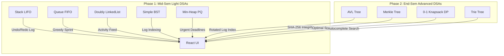

# 🛡️ MeshVault — Application Architecture, How It Works & UI Showcase

## 📋 Executive Overview

**MeshVault** is a hybrid microservices web application engineered specifically for **academic project management** and computing assignments. Designed as part of an Advanced Data Structures & Algorithms (DSA) course project, MeshVault bridges real-world web functionality (authentication, project tracking, sprint planning, and audit logging) with custom-built algorithm engines.

To support structured academic milestone evaluations, MeshVault is organized into a **2-Phase DSA System**:
- **Phase 1 (Mid-Sem Evaluation)**: Fundamental, lightweight data structures (**Stack**, **Queue**, **Doubly LinkedList**, **Simple BST**, **MinHeap Priority Queue**).
- **Phase 2 (End-Sem Evaluation Roadmap)**: Advanced algorithms (**AVL Balanced BST**, **SHA-256 Merkle Tree**, **0-1 Knapsack DP**, **Trie Prefix Tree**).

---

## 🏗 System Architecture & Technology Stack

```
┌─────────────────────────────────────────────────────────────┐
│                    React 19 Frontend                        │
│             (Vite + Tailwind CSS + Axios)                   │
│                     [Port: 5173]                            │
└──────────────┬──────────────────────────────┬───────────────┘
               │                              │
               │ REST API / JWT               │ REST API (DSA)
               ▼                              ▼
┌──────────────────────────────┐┌─────────────────────────────┐
│     Node.js / Express        ││       Python FastAPI        │
│        API Gateway           ││        DSA Microservice     │
│        [Port: 5000]          ││          [Port: 8000]       │
└──────────────┬───────────────┘└──────────────┬──────────────┘
               │                               │
               ▼                               ▼
┌──────────────────────────────┐┌─────────────────────────────┐
│       MongoDB Database       ││    In-Memory DSA Engines    │
│  (Users, Workspaces, Tasks)  ││ (Phase 1 Light + Phase 2)   │
└──────────────────────────────┘└─────────────────────────────┘
```

---

## ⚙️ The 2-Phase DSA Engines

Located in [`backend-python/dsa_engine.py`](file:///d:/SEM_3/23AID204-Advanced%20DSA/MeshVault/backend-python/dsa_engine.py):



### 🔹 Phase 1: Mid-Sem Fundamental Engines (Active)

1. **📚 Stack (`Stack`)**: LIFO stack for recording recent user actions and enabling single-step undo operations.
2. **📥 Queue (`Queue`)**: FIFO queue for sequential task processing and lightweight greedy sprint task allocation.
3. **🔗 Doubly LinkedList (`DoublyLinkedList`)**: Bi-directional node structure powering the activity history trail and navigation feed.
4. **🌲 Simple BST (`SimpleBST`)**: Unbalanced Binary Search Tree for indexing project logs by Unix timestamp.
5. **🔺 MinHeap Priority Queue (`MinHeapPQ`)**: Urgent deadline manager sorting deliverables earliest-first ($O(1)$ peek, $O(\log N)$ extraction).

### 🔸 Phase 2: End-Sem Advanced Engines (Roadmap)

1. **🌲 Self-Balancing AVL Tree (`AVLTree`)**: Height-balanced BST guaranteeing strictly $O(\log N)$ log operations via single and double rotations.
2. **🌳 SHA-256 Merkle Tree (`MerkleTree`)**: Cryptographic binary hash tree verifying bi-weekly lab submission integrity.
3. **🎒 0-1 Knapsack DP (`KnapsackDP`)**: Dynamic programming matrix solver maximizing sprint output value within capacity constraints.
4. **🔍 Trie Prefix Tree (`Trie`)**: Character-by-character prefix tree for sub-linear search autocomplete.

---

## 🎯 Mid-Sem vs. End-Sem Feature Mapping

| Application Feature | Mid-Sem Engine (Phase 1) | End-Sem Engine (Phase 2 Roadmap) |
|---|---|---|
| **Urgent Review Deadlines** | Min-Heap Priority Queue | Min-Heap Priority Queue |
| **Audit Log Indexing** | Simple BST (Timestamp Key) | Self-Balancing AVL Tree |
| **Log History & Rollback** | Stack (LIFO) & Doubly LinkedList | SHA-256 Merkle Tree Hash Proofs |
| **Sprint Task Allocation** | FIFO Queue + Greedy Scheduler | 0-1 Knapsack Dynamic Programming |
| **Search Suggestions** | Simple Queue/Linear Lookup | Trie Character Prefix Tree |

---

## 🚀 How to Run MeshVault Locally

### 1. Python DSA Microservice
```bash
cd backend-python
pip install -r requirements.txt
python main.py
# Health Check: http://localhost:8000/health
# Phase Info: http://localhost:8000/api/dsa/phase-info
```

### 2. Node.js Express Gateway
```bash
cd backend-node
npm install
npm run dev
# Health Check: http://localhost:5000/health
```

### 3. React Frontend Web Application
```bash
cd frontend
npm install
npm run dev
# Web App: http://localhost:5173
```

---

*Documentation updated by Antigravity AI for MeshVault Academic Project Manager.*
